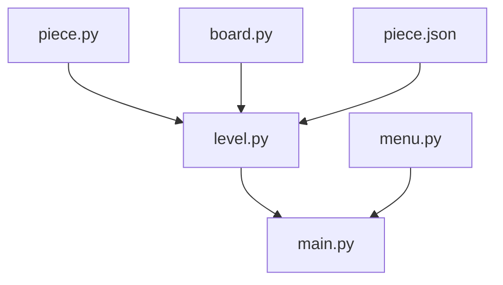

# animals_chess

[](https://www.python.org/)

使用```pygame```和```pygame_gui```完成的简单的斗兽棋游戏

完成了游戏的基本流程和简单的开始界面

```python```版本:3.6+


### 框架



```main.py```：主程序，控制游戏的进行状况

```menu```：创建图形界面

```level```：棋局进行中的主要类和方法

```piece.py```：棋子类，提供控制棋子的方法

```board.py```：生成棋盘

```piece.json```：储存了创建棋子实例的信息


### 游戏规则
游戏规则如下:

胜利条件: 

    1.吃掉对方全部棋子

    2.走入对方兽穴(不可进入自己洞穴)

吃法: 

1.象>狮>虎>豹>狼>狗>猫>鼠>象

2.同类棋子先行者吃掉对方

3.老鼠可以进河,老鼠在河里时,岸上的动物不能捕食他,他也不能捕食岸上的动物

4.狮\虎在河中没有老鼠阻挡时可以跳过河,并可吃掉对岸的较小的动物

5.进入敌方陷阱后,任意一个棋子都可以吃掉他。


