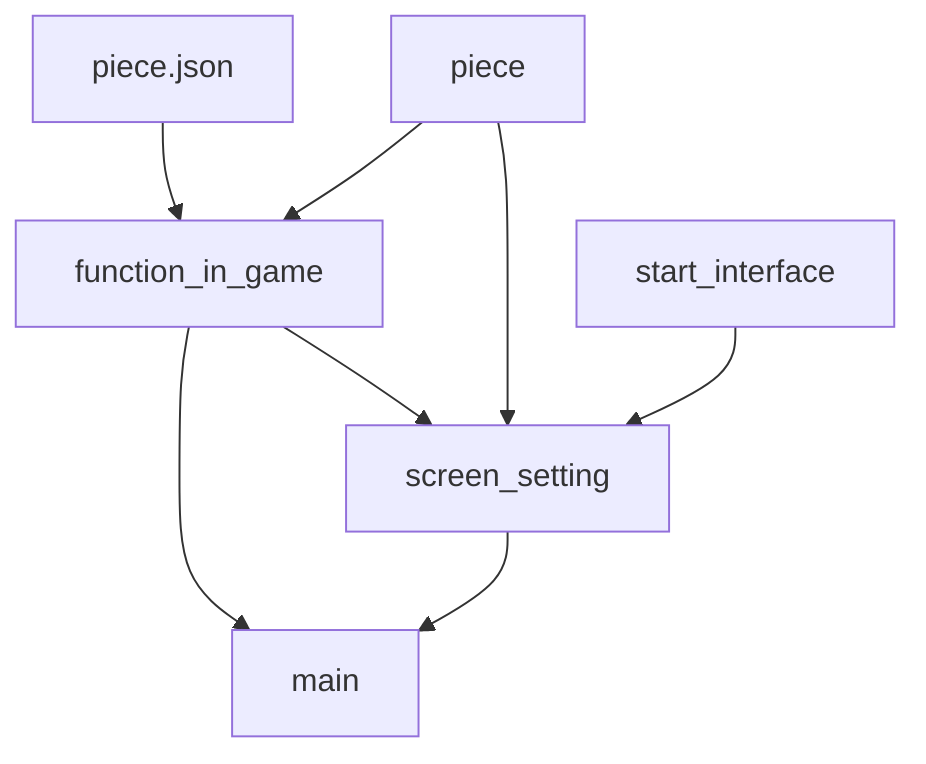

# animals_chess

一个简单的斗兽棋游戏

仅完成了游戏的基本流程和一个简单的开始界面

使用pygame

### 框架

piece:棋子类

function_in_game:提供了棋局中使用的函数

start_interface:开始菜单使用的button

screen_setting:封装了pygame的部分函数

### 游戏规则
游戏规则如下:

胜利条件: 

    1.吃掉对方全部棋子

    2.走入对方兽穴(不可进入自己洞穴)

吃法: 

1.象>狮>虎>豹>狼>狗>猫>鼠>象

2.同类棋子先行者吃掉对方

3.老鼠可以进河,老鼠在河里时,岸上的动物不能捕食他,(他也不能捕食岸上的动物?)

4.狮\虎在河中没有老鼠阻挡时可以跳过河,并可吃掉对岸的较小的动物

5.进入(敌方?)陷阱后,任意一个棋子都可以吃掉他,(每个陷阱只能使用一次?)

