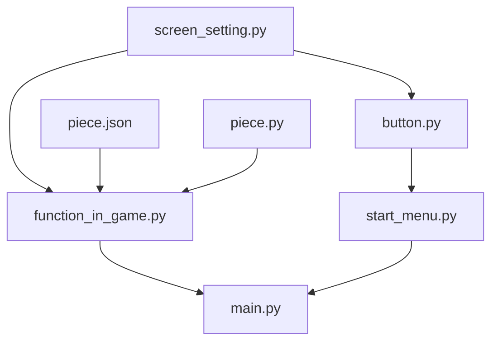

# animals_chess

[](https://www.python.org/)

一个简单的斗兽棋游戏

仅完成了游戏的基本流程和一个简单的开始界面


### 框架




```screen_setting.py```：封装了pygame的部分函数，提供绘制图形和处理事件的方法

```piece.py```：棋子类，提供控制棋子的方法

```piece.json```：储存了创建棋子的信息

```function_in_game.py```：提供了棋局中使用的函数

```button.py```：创建按钮

```start_menu.py```：开始菜单

```main.py```：控制游戏流程


### 游戏规则
游戏规则如下:

胜利条件: 

    1.吃掉对方全部棋子

    2.走入对方兽穴(不可进入自己洞穴)

吃法: 

1.象>狮>虎>豹>狼>狗>猫>鼠>象

2.同类棋子先行者吃掉对方

3.老鼠可以进河,老鼠在河里时,岸上的动物不能捕食他,(他也不能捕食岸上的动物?)

4.狮\虎在河中没有老鼠阻挡时可以跳过河,并可吃掉对岸的较小的动物

5.进入(敌方?)陷阱后,任意一个棋子都可以吃掉他,(~~每个陷阱只能使用一次?~~)

    括号内的为不确定的规则


